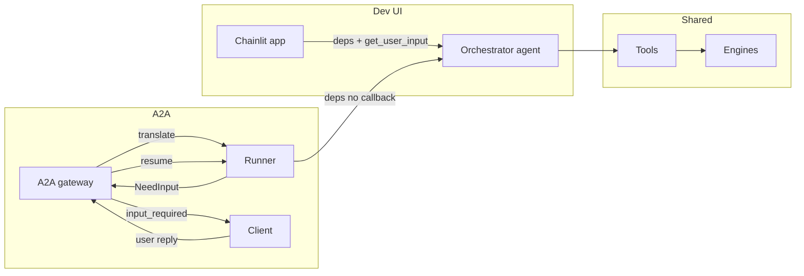

# Unified orchestrator: two surfaces, one brain

The refactor agent exposes two surfaces — a **dev Chat UI** and an **A2A (agent-to-agent) gateway** — that share a single orchestrator: one agent, one set of tools, one engine layer. Only the outer layers differ; both surfaces use the same “brain” and support user-input requests (e.g. rename collision → alternative name or confirm).

## High-level schematic

## Shared core

- **Orchestrator:** One agent (same model, instructions, tools). It receives a user message and workspace context and drives refactor operations via tools.
- **Tools:** Rename, find references, remove declaration, move symbol, format, organize imports, diagnostics, file listing, etc. All tools use the same engine layer.
- **Engines:** Language-specific AST and refactor engines (e.g. LibCST, TsMorph) behind a single registry. No duplicate logic between surfaces.

When a tool needs user input (e.g. name collision), it uses a single contract: **NeedInput** (type, message, payload). If a callback is provided, the tool blocks until the user replies; if not, the tool returns a serialized NeedInput so the runner can surface it and resume later.

## Dev UI (Chainlit)

Thin adapter around the orchestrator:

- Builds **deps** with `get_user_input` implemented via Chainlit `AskUserMessage` / `AskElementMessage`.
- Runs the same orchestrator; tools that need input call the callback and block, so the run completes in one go.
- Full feature visibility; only the outer layer (deps and Chainlit Ask APIs) is UI-specific.

See [Chat UI (Chainlit)](chat-ui.md) for usage.

## A2A

Thin adapter for agent-to-agent callers:

- **Gateway** translates incoming A2A messages into an internal request and runs the orchestrator with **no** `get_user_input` callback.
- When the runner gets **NeedInput** (e.g. collision), it emits A2A `input_required` and persists run state; the client replies in a follow-up message.
- **Resumption:** Next message loads state, appends the user reply, and continues the orchestrator until completion or another NeedInput.
- The Agent Card exposes a single generic “refactor” skill; human-in-the-loop (e.g. collision) is via `input_required` and the next message.

See [A2A server (HTTP)](a2a-server.md) for endpoints and request formats.

## Summary

| Surface   | Role                          | User input when needed        |
|----------|-------------------------------|-------------------------------|
| **Dev UI** | deps + `get_user_input`      | Tools block on Chainlit Ask   |
| **A2A**    | deps, no callback; runner    | NeedInput → `input_required` → resume |

**A2A is opaque** (single refactor skill; tools/engine not exposed to callers). **Dev UI (Chainlit) is transparent** (full feature visibility) and must be highly secured when hosted; see [GCP infrastructure](infra/gcp.md) for deployment.

One orchestrator, two surfaces; all substantial logic lives in the shared core.
