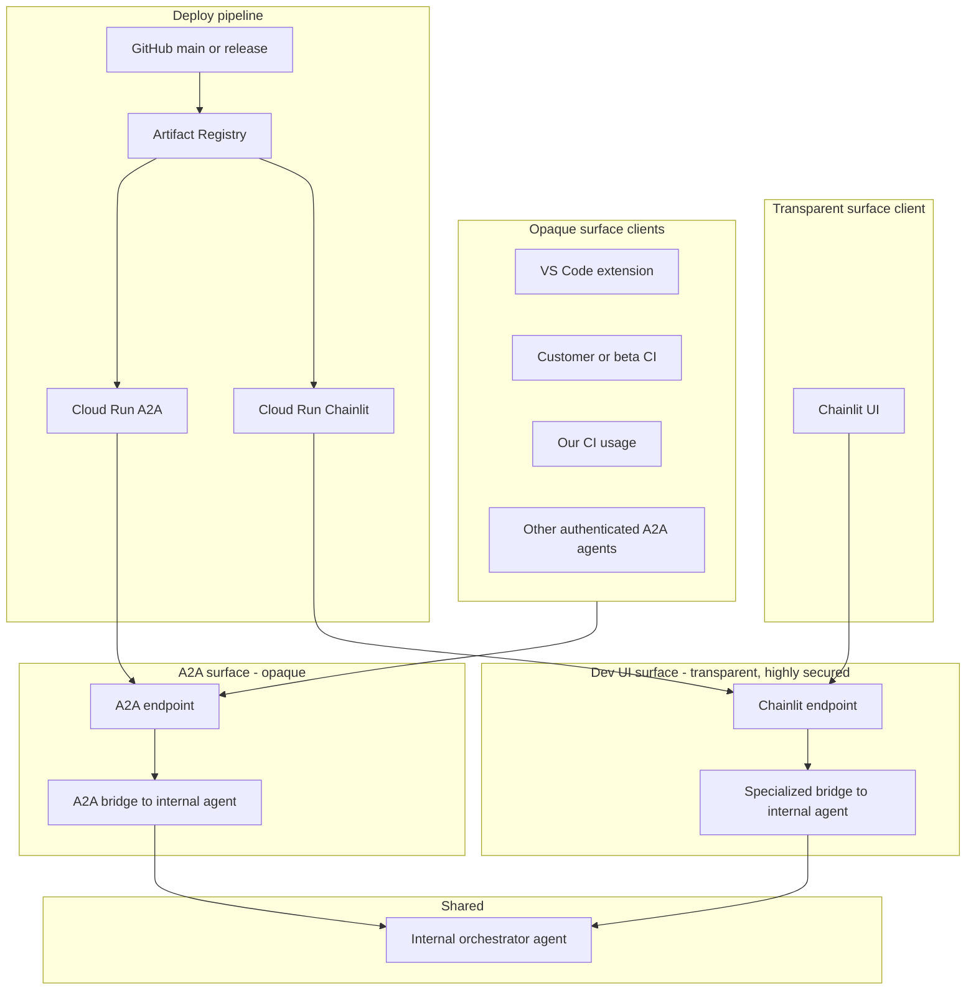

# GCP infrastructure (Terraform, EU-only)

Deploy the A2A refactor backend (and later the dashboard) on GCP with Terraform. All resources run in **europe-west1** (Belgium, closest to Ghent) for **GDPR**; nothing is stored or run outside the EU.

## Two entry surfaces (opaque vs transparent)

The internal agent is reached through **two distinct surfaces** (see [architecture.md](architecture.md)):

| Surface | Clients | Endpoint | Visibility |
|---------|---------|----------|------------|
| **A2A (opaque)** | VS Code extension, customer/beta CI, our CI usage, other authenticated A2A agents | A2A HTTP endpoint | Opaque: Agent Card exposes a single generic refactor skill; tools/engine not exposed. |
| **Dev UI (transparent)** | Chainlit only | Separate endpoint, highly secured | Transparent: full feature visibility; same orchestrator, different outer layer. |

Chainlit is intentionally **not** opaque; all other callers go through A2A. When hosted, the Chainlit Cloud Run service is the transparent surface and must be secured (IAM or IAP); do not use `allUsers` for it.

## High-level diagram (dev endpoints)



## When to use GCP vs local

| Use case | Recommendation |
|----------|-----------------|
| Local dev, Cursor/MCP, quick iteration | **Local**: `docker compose up a2a-server` or run sync + A2A scripts (see [Docker deployment](docker-deployment.md)). |
| Testing VS Code extension against a stable URL | **GCP**: Deploy A2A to Cloud Run, set `refactorAgent.a2aBaseUrl` to the Cloud Run URL. |
| Hosted Chainlit (transparent UI) | **GCP**: Deploy Chainlit as a second Cloud Run service; set `chainlit_image` and `chainlit_invoker_member` in tfvars. Output `chainlit_url`. |
| CI (refactor check) | Runs in GitHub Actions; no GCP required. Optional: CI can POST results to the dashboard ingestion URL (set when dashboard is deployed). |
| Dashboard (list/detail issues) | Deploy dashboard as a second Cloud Run service when ready; Terraform can be extended with `cloudrun_dashboard.tf`. |

## Deploy steps

1. **Prerequisites**: gcloud, Terraform, billing-enabled GCP project. See [infra/README.md](../infra/README.md).
2. **Build and push the A2A image** to Artifact Registry (europe-west1):

   ```bash
   gcloud builds submit --tag europe-west1-docker.pkg.dev/YOUR_PROJECT/refactor-agent/a2a-server:latest . --project=YOUR_PROJECT
   ```

3. **Terraform**: From repo root, `cd infra`, create a `dev.tfvars` with `project_id`, `region = "europe-west1"`, and `a2a_image` set to the image you pushed. Run `terraform init`, `terraform plan -var-file=dev.tfvars`, `terraform apply -var-file=dev.tfvars`.
4. **Secrets**: Add the Anthropic API key to Secret Manager (see infra/README.md). Cloud Run reads it as `ANTHROPIC_API_KEY`.
5. **A2A URL**: `terraform -chdir=infra output a2a_url`. Use this in the VS Code extension or scripts.

## Extension, Chainlit, and CI config

- **VS Code extension**: Set **A2A base URL** to the Cloud Run URL (e.g. `https://a2a-server-xxx-ew.a.run.app`). For hosted backend without sync, the extension can send workspace-in-JSON; no sync service is deployed on GCP.
- **Hosted Chainlit**: When `chainlit_image` is set in tfvars, Terraform deploys a second Cloud Run service. Set `REFACTOR_AGENT_A2A_URL` in that service to the A2A URL (Terraform sets it automatically). Use `chainlit_invoker_member` (e.g. `user:you@example.com`) so only you can open the Chainlit URL; do not use `allUsers`. Get the URL with `terraform -chdir=infra output chainlit_url`.
- **CI**: No change required for the refactor check. To send results to the dashboard, set `REFACTOR_AGENT_INGEST_URL` and `REFACTOR_AGENT_INGEST_API_KEY` in the workflow once the dashboard is deployed.

## Sync not deployed

The sync server (WebSocket + `POST /sync/workspace`) is not deployed on Cloud Run. For hosted use, the VS Code extension (and other clients) should use **workspace-in-JSON** in the A2A request body; the executor supports both `use_replica` and inline workspace.

## Beta users and pricing

This setup is for **dev and self-testing**. For **beta users** (external testers using the extension) you want persistent workspace between conversations and minimal cost. See [infra-beta-pricing.md](infra-beta-pricing.md) for options (e.g. Fly.io machines with sleep-to-zero, Modal) and how they fit with the current GCP plan.
