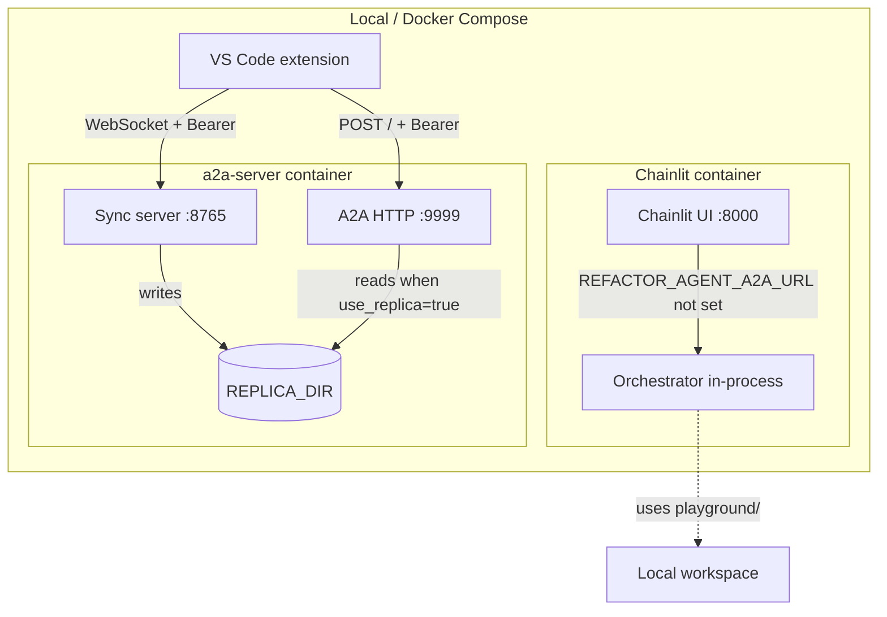
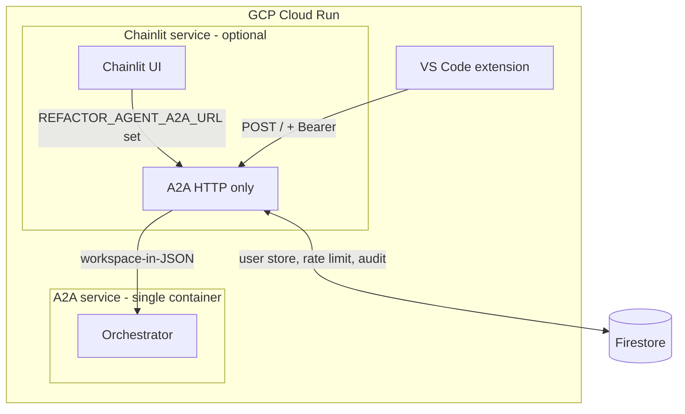

# Current deployment architecture (as of Feb 2025)

Schematic of what runs where and how the surfaces connect.

---

## Local / Docker

- **Chainlit (local)**: Runs orchestrator **directly in-process**. No A2A, no sync. Uses `playground/` as workspace.
- **a2a-server (local)**: Sync + A2A in one container, shared `REPLICA_DIR`. Extension syncs via WebSocket, then calls A2A with `use_replica: true`.
- **Auth**: Extension sends GitHub Bearer token to both sync and A2A.

---

## Cloud Run (hosted)

- **A2A (Cloud Run)**: **A2A only**. No sync server deployed. `entrypoint-cloudrun.sh` runs `run_ast_refactor_a2a.py` only.
- **Sync**: **Not deployed** on Cloud Run. Extension uses **workspace-in-JSON** (inline files in request body).
- **Chainlit (hosted)**: Separate Cloud Run service. `REFACTOR_AGENT_A2A_URL` is set → Chainlit **calls A2A over HTTP**. Does **not** run orchestrator in-process.
- **Auth**: A2A requires GitHub OAuth (Bearer). Chainlit does **not** send auth when calling A2A → hosted Chainlit would get **401** today.

---

## Summary table

| Surface        | Local                          | Cloud Run (hosted)                    |
|----------------|--------------------------------|---------------------------------------|
| **Chainlit**   | Orchestrator in-process        | Calls A2A (no auth sent → 401)        |
| **VS Code ext**| Sync + A2A (GitHub Bearer)     | A2A only, workspace-in-JSON (GitHub Bearer) |
| **Sync server**| Yes (port 8765)               | **No** – not deployed                 |
| **A2A**        | Yes (port 9999)               | Yes (single service)                  |

---

## Gaps

1. **Hosted Chainlit → A2A**: Chainlit does not send `Authorization: Bearer` when calling A2A. Hosted Chainlit would fail with 401. Needs a service-to-service key or GitHub OAuth passthrough.
2. **Sync not on Cloud Run**: Extension cannot use sync + `use_replica` when pointing at hosted A2A. Workspace-in-JSON is the only path; large workspaces are slower.
3. **Chainlit vs A2A**: The architecture doc says Chainlit talks to the orchestrator directly. That’s true **locally**. When hosted, Chainlit goes through A2A like any other client.
