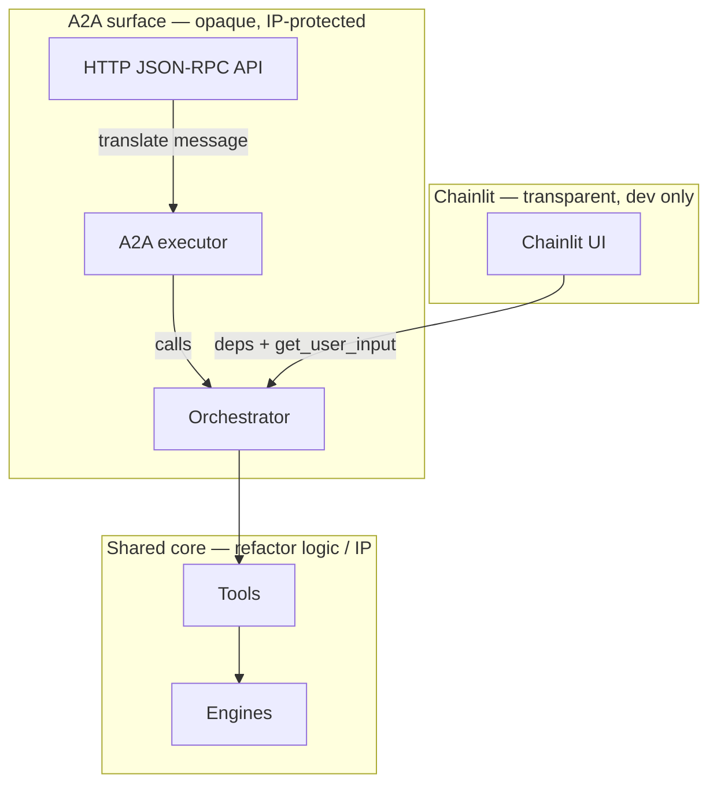
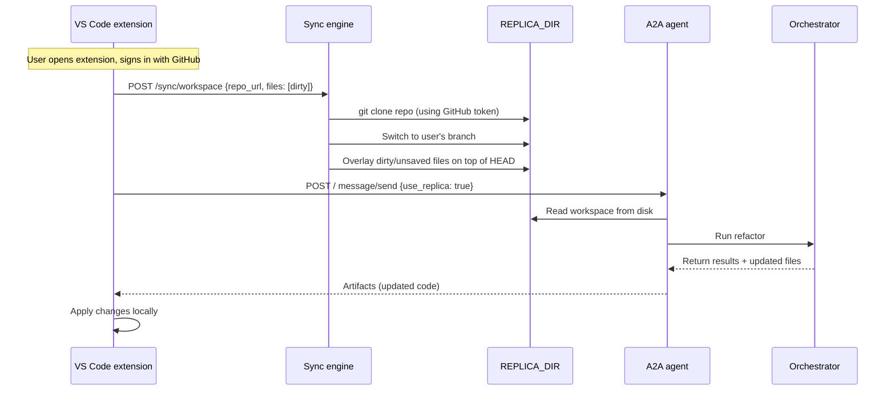
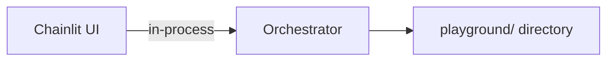
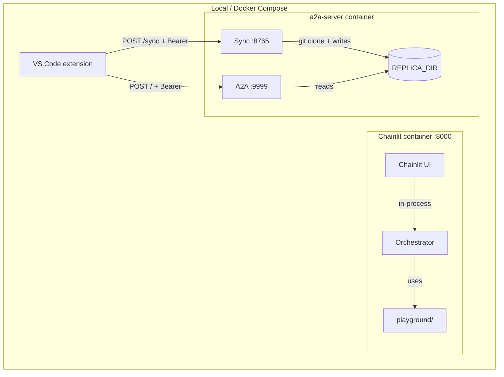
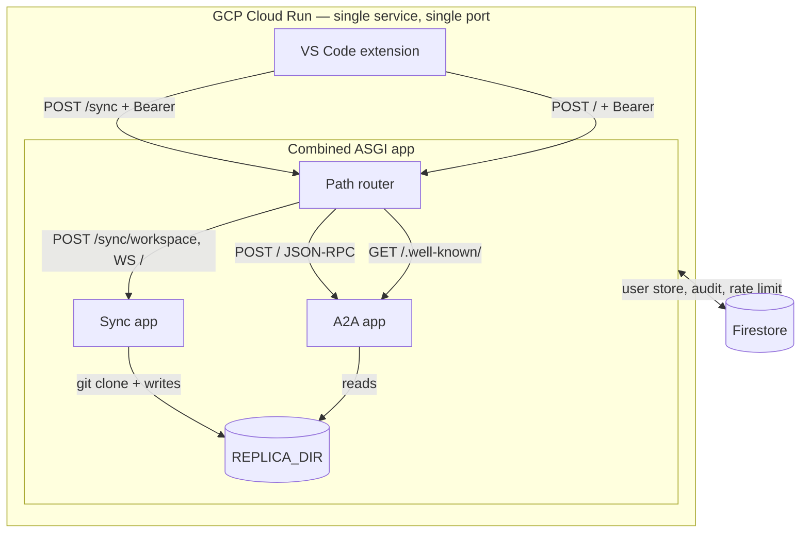
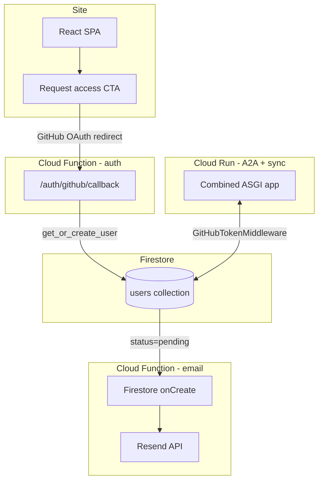

# Refactor Agent: Architecture Schematic

A clear map of components and how they connect.

---

## 1. What each piece is

| Component | What it is |
|-----------|------------|
| **Orchestrator (internal agent)** | The core refactor logic: PydanticAI agent, tools (rename, find refs, etc.), engines (LibCST, TsMorph). Lives in `refactor_agent.orchestrator` and `refactor_agent.engine`. **IP lives here.** |
| **A2A agent** | HTTP JSON-RPC API (Agent-to-Agent protocol). Thin wrapper: receives refactor requests, calls the orchestrator, returns results. **Separate from orchestrator by design** — protects IP by exposing only a generic "refactor" skill. |
| **Sync engine** | WebSocket + POST endpoint that receives workspace files from clients and writes them to `REPLICA_DIR`. Also handles `git clone` on first connect. Lets the A2A executor read files from disk. |
| **Chainlit** | Dev/test chat UI. Calls the **orchestrator directly** (in-process). Used for quick testing of staging/prod against playgrounds. Not a customer surface. |

---

## 2. Orchestrator vs A2A agent (separate by design)

- **A2A agent** = HTTP layer + executor. Opaque. Callers only see "refactor" skill.
- **Orchestrator** = the actual refactor agent with all tools and engines. IP lives here.
- **Chainlit** calls the orchestrator **directly** (no A2A). Dev/test surface only.

---

## 3. Sync engine: workspace lifecycle

The sync engine feeds workspace files to `REPLICA_DIR` so A2A can operate on them. It is **not** another way to reach the orchestrator.

### Full flow (VS Code extension)

### Steps in detail

1. **User opens extension** on a GitHub repo, signs in (GitHub OAuth → token with `repo` + `read:user` scope).
2. **Sync — initial connect**: Extension sends `repo_url` + only dirty/unsaved files (from `git status`). Server does `git clone` into `REPLICA_DIR` using the token, switches to the correct branch.
3. **Sync — live changes**: As the user saves files locally, extension sends file diffs over sync. Replica stays up to date with uncommitted state.
4. **Sync — branch switch**: If the user switches branches, extension detects and re-syncs (new clone or `git checkout`).
5. **A2A request**: Extension sends refactor request with `use_replica: true`. A2A executor reads from `REPLICA_DIR`.
6. **Results**: Orchestrator returns updated files. A2A sends artifacts back. Extension applies changes locally.

### Replica is ephemeral

- Each replica has a **TTL** — cleaned up after inactivity (e.g. no messages for N minutes).
- Replica lives on the container's filesystem. Cloud Run instances are ephemeral; replica does not survive instance eviction.
- This is fine: on reconnect, extension re-syncs (git clone + dirty overlay).

---

## 4. Chainlit: scoped role

Chainlit is the **dev/test** surface — not a customer product.

- **Local (`make ui`)**: Runs orchestrator in-process against `playground/` directory. No A2A, no sync.
- **Hosted (optional)**: Would need `REFACTOR_AGENT_A2A_URL` to call A2A, but this is **not priority**. Hosted Chainlit is only for quick smoke-testing staging/prod against hardcoded playgrounds.
- **Future**: Replace with a self-hosted open-source web IDE (e.g. Claude Code web, browser-based VS Code) for real code exploration. Chainlit is a placeholder for that vision.

---

## 5. Physical deployment

### Local / Docker

### Cloud Run — target (alpha)

- **Single service, single port, single process.** Combined ASGI app routes by path.
- **Auth**: GitHub OAuth (Bearer token) for all endpoints. Same middleware.
- **REPLICA_DIR**: Ephemeral, per-instance. TTL cleanup after inactivity.
- **Sync URL = A2A URL** — same Cloud Run service.

### Cloud Run — today (alpha)

Sync is deployed with A2A on the same URL. `entrypoint-cloudrun.sh` runs the combined backend (`run_refactor_backend.py`): single service, single port. Extension uses one URL for both sync and A2A; hosted flow works.

### Site and access request flow

The site and its auth callback are **separate** from the combined ASGI app. Both write to the same Firestore `users` collection.

- **Site**: React SPA (Firebase Hosting or static). "Request access" redirects to GitHub OAuth (web flow, `read:user user:email` scope).
- **Auth callback**: Cloud Function (HTTP). Exchanges code for token, fetches user, writes `users/{id}` with `status="pending"`, redirects to success/error page.
- **Email notify**: Cloud Function (Firestore trigger). On create in `users` where `status=pending`, sends email to admin via Resend.
- **Extension auth**: VS Code built-in GitHub auth (`vscode.authentication.getSession`). Same Firestore `users` collection; admin approves via `scripts/approve_user.py` or Firestore console.

See [site-deploy.md](site-deploy.md) for deployment.

---

## 6. Quick reference

| Question | Answer |
|----------|--------|
| Orchestrator vs A2A agent? | Separate by design. A2A is a thin HTTP wrapper; orchestrator holds the IP. |
| Does Chainlit use A2A? | No. Chainlit calls the orchestrator directly (in-process). |
| What is Chainlit for? | Dev/test surface for quick smoke-testing. Not a customer product. |
| How does code persist? | `git clone` on first sync → `REPLICA_DIR`. Dirty files overlaid. Ephemeral with TTL. |
| Workspace-in-JSON? | Removed. Executor only supports `use_replica: true`; push workspace via sync first. |
| Sync on Cloud Run today? | Yes. Combined ASGI app; same service and URL as A2A. |
| What happens on reconnect? | Re-clone + re-overlay. Replica is ephemeral; no persistence across instance eviction. |
| Site auth? | Separate Cloud Function; web OAuth writes to same Firestore `users` as extension. |
