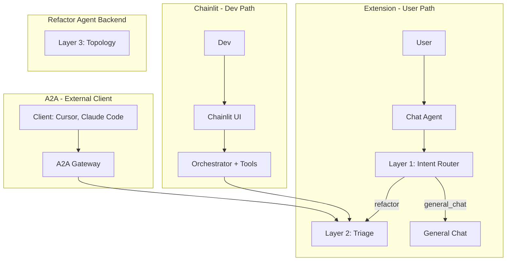
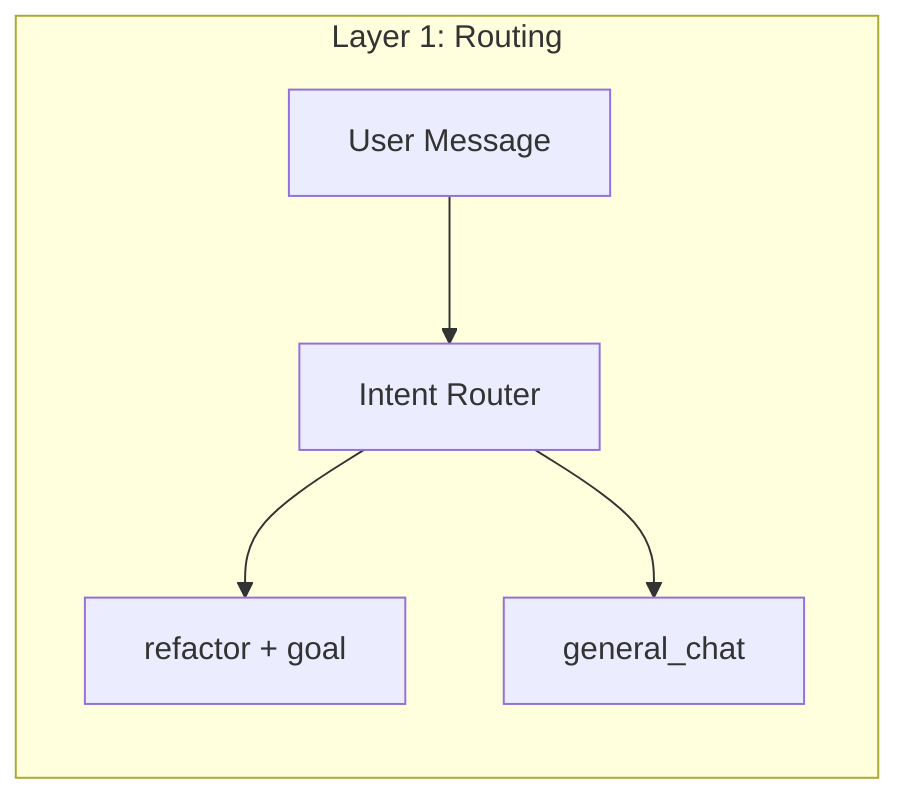
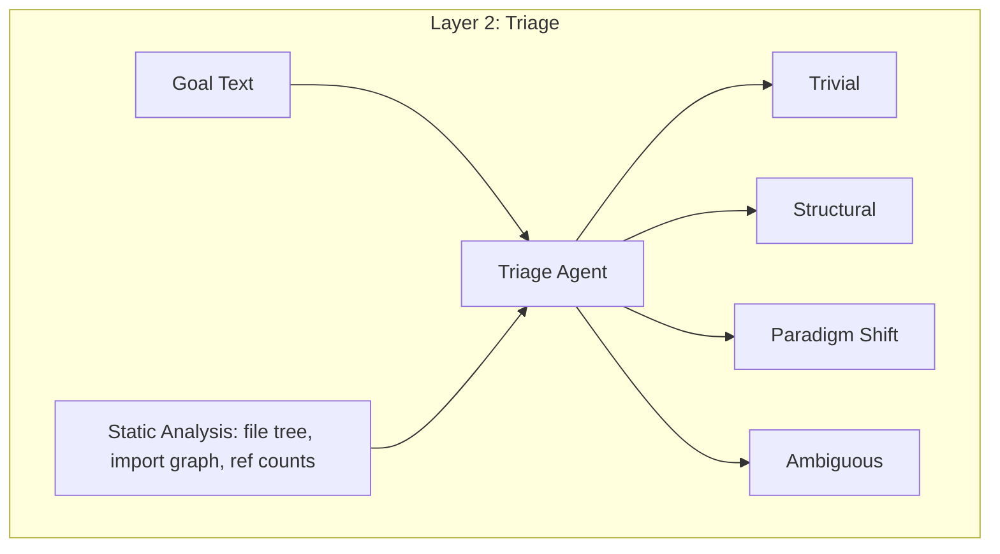
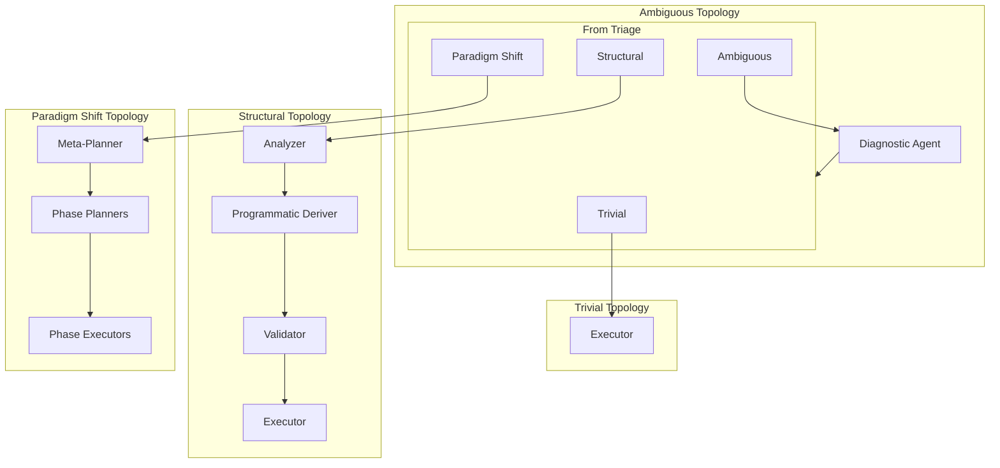
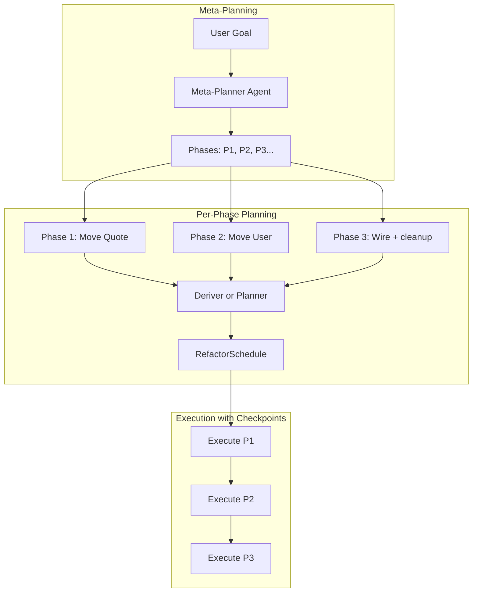
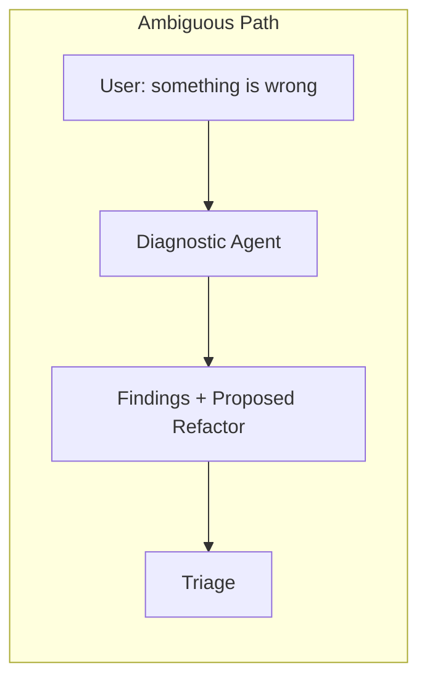
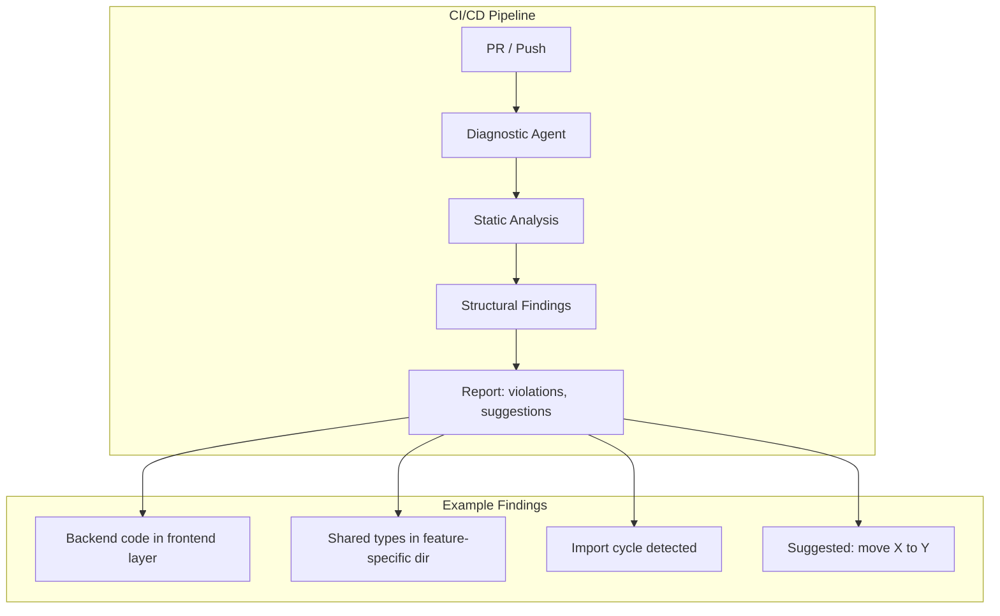
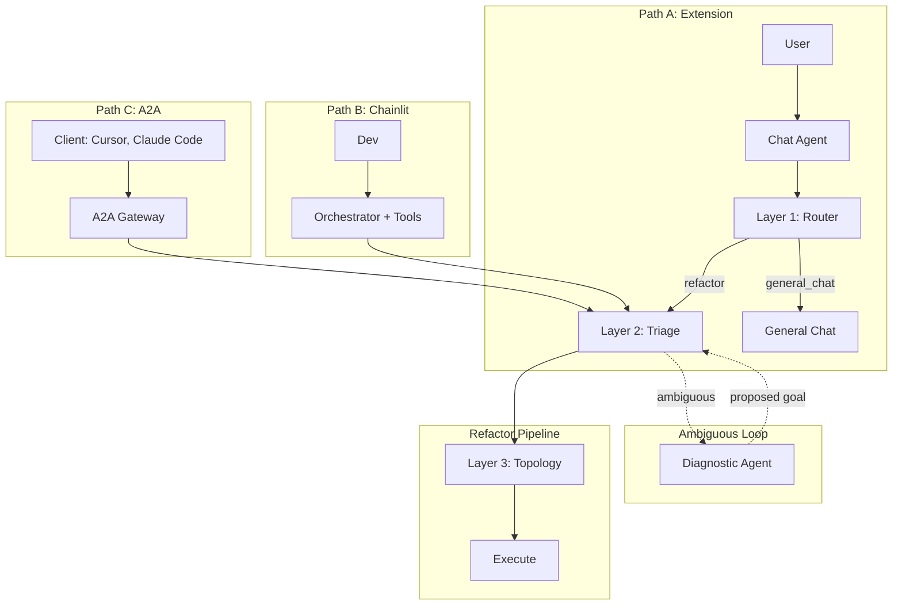
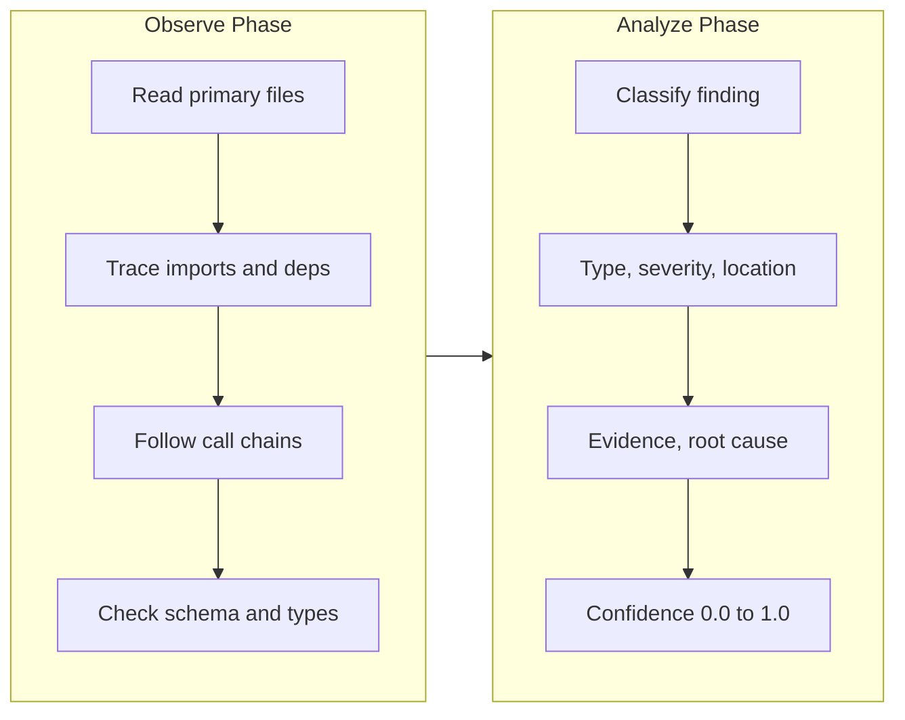
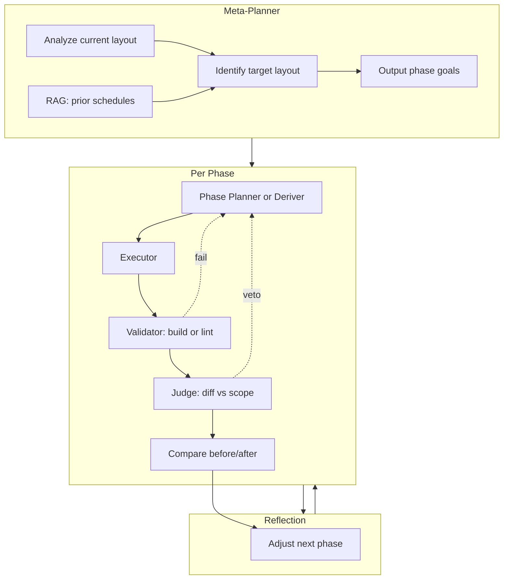

# Refactor Agent: System Design

Design-first view of the refactor agent architecture. No code — diagrams and flows only.

---

## Entry Points: Where the Chat Agent Lives

Three distinct paths. **Extension** = users, constrained UI, needs Chat + Layer 1. **Chainlit** = devs, direct access to orchestrator and tools (not for users). **A2A** = external client. To test the extension, devs use the extension, not Chainlit.



|   |   |   |   |   |
|---|---|---|---|---|
|Entry Point|Audience|Chat Agent|Layer 1|Tool Access|
|**Extension**|Users|We need our own. User types in sidebar.|Required — user may type refactor or general.|No — constrained UI.|
|**Chainlit**|Devs|Direct access to orchestrator. Dev types; orchestrator runs tools.|Not needed — dev is testing refactor agent directly.|Yes — full tool visibility for dev testing.|
|**A2A**|Via Cursor, Claude Code|Client provides chat.|Optional — client pre-routes.|Opaque — client sends requests.|

**Implication:** Layer 1 and the chat agent are **extension-only**. Chainlit bypasses them — devs talk directly to the orchestrator with full tool access.

---

## Layer 1: Chat → Refactor Detection (Routing)

**Scope:** Extension only. Chainlit gives devs direct orchestrator access; A2A callers typically send pre-routed refactor requests.

Lightweight intent router. User message → `refactor | general_chat` + extracted goal text. Guard against partial refactor intent (user describes a problem that implies a refactor but hasn't asked for one); optionally output confidence and prompt for confirmation before handoff.



---

## Layer 2: Refactor Triage (Classification)

Once refactor intent is confirmed, classify _what kind_ — the topology differs per type. **Triage must be codebase-aware**: not just NLP. A user might say "just rename this class" when it's referenced in 200 files → trivial becomes structural automatically.

**Inputs:** Goal text + lightweight static analysis (file tree, import graph, reference counts).

**Outputs:** Category + **confidence score** + structured brief (scope, estimated op count, dependencies) + **ScopeSpec** (affected_files, allowed_op_types, forbidden_op_types) for downstream agents and Judge.

**Confidence and conservative rounding:** Misclassification direction matters. Classifying a paradigm shift as structural is a bad failure (executor gets overwhelmed mid-run). Classifying structural as paradigm shift is expensive but safe (you over-plan). When confidence < threshold, **round up** to the more complex category. Triage should lean on the import graph aggressively before committing — static analysis filters hallucinations and ensures mechanical feasibility.



**Taxonomy:**

|   |   |   |
|---|---|---|
|Category|Description|Example|
|**Trivial**|Rename symbol, move single file, no cross-cutting concerns|Direct executor, no planning|
|**Structural**|Move module/directory, update imports|Single planner + programmatic deriver|
|**Paradigm shift**|DDD → vertical slice, etc.|Full hierarchical: meta-planner → phase planners → executors|
|**Ambiguous**|User knows something's wrong but not what|Diagnostic agent first → propose refactor → back to triage|

**Reversibility axis (orthogonal to type):** Some structural refactors are cheap to undo (moving a file); others are not (merging bounded contexts). Reversibility drives checkpoint strategy:

- **High reversibility** — Run multiple ops per checkpoint.
    
- **Low reversibility** — Checkpoint after every single op. Surface reversibility to the user before execution for low-reversibility refactors; natural hook for human-in-the-loop gate.
    

---

## Layer 3: Orchestrator Selection (Topology)

The topology is **dynamic** per refactor type. Each agent has its own prompt and tools; routing logic stays simple.



---

## Paradigm Shift: Hierarchical Flow (Detail)

For DDD → vertical slice and similar, the full flow:



---

## Diagnostic Agent

For **Ambiguous** refactors: user knows something's wrong but doesn't know what. The diagnostic agent analyzes the codebase and **proposes** the refactor before planning begins. Output: structured findings + suggested refactor goal → fed back into triage.



**Key capability:** The diagnostic agent figures out _what is wrong_ — boundary violations, misplaced modules, naming inconsistencies, etc. It does not execute; it proposes.

**Ambiguous loop termination:** The diagnostic agent routes back to triage, but triage may return "ambiguous" again. Without an explicit escape, the loop can spin. **Termination condition:** After N diagnostic rounds (e.g. 2), either (a) escalate to human confirmation, or (b) force-classify as structural with the diagnostic findings as the plan. Never allow unbounded ambiguous → diagnostic → triage cycles.

---

## Diagnostic Agent in CI/CD

The diagnostic agent is especially useful for **CI/CD checks**: it runs on the codebase without user input and reports structural issues. No refactor execution — just analysis and reporting.



**Flow:**

- CI runs diagnostic agent on changed files (or full repo).
    
- Agent uses file tree, import graph, layer boundaries (if configured).
    
- Output: list of violations + optional suggested refactor goals.
    
- No execution; human or chat flow can then invoke the refactor pipeline with the suggested goal.
    

---

## End-to-End: Three Paths

**Path A — Extension (users):** User message → Chat Agent → Layer 1 Router → Triage → Topology → Execute.

**Path B — Chainlit (devs):** Dev message → Orchestrator (direct, full tools) → Triage → Topology → Execute. No Chat Agent, no Layer 1.

**Path C — A2A (Cursor, Claude Code):** Client sends refactor request → A2A Gateway → Triage (Layer 1 skipped) → Topology → Execute.



---

## Implementation Ideas (from Research and Practice)

Practical patterns from RefAgent, Codebase Auditor, Kinde, OpenRewrite, and OpenHands for implementing the diagnostic agent, structural topology, and paradigm-shift topology.

---

### Diagnostic Agent: Practical Implementation

**Observe-Analyze separation (TraceCoder, Codebase Auditor):** Separate observation from analysis. Agents that jump to conclusions before thoroughly reading code produce worse assessments. Force a structured observe phase that must complete before analysis begins.



**Playbooks:** Encode institutional knowledge as checklists. Example playbooks for refactor-agent:

- **Boundary violation** — Backend in frontend layer, shared types in feature dir, cross-layer imports
    
- **Dead code** — Unused exports, files with no references, stale dependencies
    
- **Import hygiene** — Cycles, transitive bloat, wrong layer dependencies
    

**Read-only by design:** The diagnostic agent never modifies code. It can be aggressive in investigation without risk. Separation of diagnosis from treatment — downstream planner/executor decides what to fix.

**Architecture-aware findings:** Map each finding to affected layers and cascade risks. For DDD: `domain → application → infrastructure → frontend`. A violation in one layer may cascade; report `affected_layers` and `cascade_risks`.

**CI/CD integration:** Run on changed files or full repo. Output: structured findings with `file:line`, type, severity, confidence. Findings below 0.7 confidence flagged as "needs verification." Cross-reference known issues (e.g. CLAUDE.md) to avoid redundant reports.

**Tools:** File tree, import graph (forward/reverse), reference counts. Use ts-morph `find_references` and project structure. No AST graph required — structured navigation (follow imports, callers, types) suffices.

---

### Structural Topology: Practical Implementation

**Programmatic deriver + validator:** For move-module, update-imports: derive ops from static analysis; agent validates or fills gaps.

**Reference:** OpenRewrite — MoveFile recipe with `fileMatcher`, `moveTo`; import updates via visitors. Recipes compose: link multiple recipes for larger goals.

**Dependency graph for ordering:** Use import graph (forward/reverse) to infer `dependsOn`. Tools: Go `importgraph`, Python `pydeps`/ImportLab, TypeScript ts-morph. Order ops by: (1) no incoming deps first, (2) transitive closure for batches. Detect cycles (SCC) before attempting refactor.

**Flow:**

1. **Analyzer** — Build file tree, import graph, ref counts. Output: scope, affected files.
    
2. **Deriver** — Given layout mapping (e.g. `domain/entities/X` → `Feature/X/entities/X`), emit `MoveFileOp` list. Infer `dependsOn` from import graph.
    
3. **Validator** — Agent reviews derived schedule; adds renames or `move_symbol` where template doesn't fit, or approves. **Same ScopeSpec as paradigm-shift Judge:** receives `ScopeSpec` from triage (affected_files, allowed_op_types, forbidden_op_types). **Dry-run before approve:** simulate schedule against import graph — verify no cycles introduced, no dangling imports, target paths valid. Approve only if dry-run passes and schedule stays within ScopeSpec.
    
4. **Executor** — Topo sort by `dependsOn`, run ops.
    

**Parallelization:** Independent ops (no shared file) can run in parallel. Use waves: wave 1 = ops with no deps; wave 2 = ops depending only on wave 1; etc.

---

### Paradigm Shift Topology: Practical Implementation

**Multi-agent roles (RefAgent, Kinde):** Specialized agents for planning, execution, testing, reflection. Single agent struggles; multi-agent improves unit test pass rate (64.7%), compilation success (40.1%).

**RefAgent roles:**

- **Context-aware Planner** — Dependency analysis (jdeps), code metrics, code search. Output: refactoring plan with explicit instructions for downstream agents.
    
- **Refactoring Generator** — Applies plan; produces refactored code.
    
- **Compiler Agent** — Validates syntax; on failure, sends error summary to Generator.
    
- **Tester Agent** — Runs tests; on failure, sends report to Generator. Up to 20 iterations.
    

**Kinde workflow:**

- **Orchestrator** — Receives goal; breaks down and assigns to specialists.
    
- **Architect Agent** — Analyzes codebase; outputs detailed plan, API contracts, migration sequence.
    
- **Code Migration Agent** — Receives plan; applies changes in small steps.
    
- **Test Validator Agent** — Runs tests; reports back. Cycle continues until tests pass.
    

**For refactor-agent (paradigm shift):**



**Judge agent at phase boundaries:** LLM-as-judge uses the diff of the proposed change and a **structured scope spec** to evaluate whether the agent stayed within scope. Veto ~25% of agent sessions; agent can course-correct on veto. For paradigm shifts, agents tend to "go beyond scope" (e.g. reformatting 40 files while doing a legitimate move). The original user goal string alone is too loose — the judge needs a **scope constraint envelope** generated at triage time and passed through to every downstream agent and judge:

```
ScopeSpec {
  affected_files: list[str]      # only these files may be modified
  allowed_op_types: list[str]    # e.g. ["move_file", "rename", "organize_imports"]
  forbidden_op_types: list[str]  # e.g. ["create_file"] if not in plan
}
```

Judge receives: git diff + ScopeSpec + original goal. Detects scope creep (files outside `affected_files`, ops in `forbidden_op_types`).

**RAG for the meta-planner:** MANTRA showed 582/703 vs RawGPT 61/703 — difference attributed to contextual retrieval and few-shot examples. Store phase outputs from prior successful refactor runs. RAG over _prior successful refactor schedules_: if you've done DDD→vertical slice before, the phase structure from that run is a strong prior for the next one.

**Per-phase "done" definition:** "The executor didn't crash" ≠ "Phase N left the codebase in a valid state for Phase N+1." Each phase checkpoint needs its own success criteria: tests pass, build succeeds, no new lint errors, diagnostics clean, no dangling imports. A phase that half-moved a module and left dangling imports will silently corrupt every subsequent phase.

**Key practices:**

- **Iterative feedback:** Compilation or test failure → send error summary to Generator; refine up to N iterations.
    
- **Context retrieval:** Planner uses dependency graph, code metrics, related source. Don't plan in a vacuum.
    
- **Explicit handoff:** Planner output is structured (instructions interpretable by downstream agents). No free-form prose.
    
- **Human in the loop (initially):** Start with agents proposing changes; human approves. Gradually increase autonomy.
    

**Parallel phase planners:** For independent phases (e.g. “Move Quote” and “Move User” with no shared files), run phase planners in parallel. Sequential phase executors with checkpoints between phases.

**Chunked planning:** For very large codebases, split by domain/directory. "Plan refactor for `src/Module/Quote` only," then "Plan for `src/Module/User`," then "Wire app.module and remove legacy." Each plan stays within token/tool budget.

---

### Cross-Cutting: Tooling and Context

**Tools agents need:**

- `run_tests()` — Execute test suite; return pass/fail and logs.
    
- `lint_file(path)` — Lint; return diagnostics.
    
- `get_dependency_graph()` — Forward/reverse import graph.
    
- `find_references(file, symbol)` — All refs across project.
    
- `get_skeleton(file)` — AST skeleton for context.
    

**Context summarization:** LLMs have finite context. Pass only what each agent needs. Planner: file tree + metrics + target layout. Generator: source + plan + error summary. Use summaries, not full file contents, when possible.

**Meta-planner context budget:** The meta-planner for a large paradigm shift is the hardest case — it needs full file tree, import graph summary, and RAG results at once. When that exceeds context: **chunked planning is the overflow strategy.** Scope to one domain at a time: "Plan refactor for `src/Module/Quote` only," then "Plan for `src/Module/User`," then "Wire app.module and remove legacy." Each chunk stays within budget; the meta-planner emits phase goals per chunk rather than one monolithic plan.

**Defining "done":** Agent might think done when code compiles. Define robust criteria: tests pass, build succeeds, no new lint errors, diagnostics clean. Document in agent instructions. For paradigm shifts, **per-phase** done criteria are critical — each checkpoint must leave the codebase valid for the next phase.

---

## Git Infrastructure

Every phase executor modifies files. Checkpoints and rollback need a defined git strategy — git is the coordination layer (Anthropic compiler experiment). It doubles as checkpoint/rollback mechanism and must be designed as such.

**Strategy:**

- **Branch per refactor run:** Each refactor session runs on its own branch (e.g. `refactor/ddd-to-slice-<timestamp>`). Base branch stays clean.
    
- **Commit after each phase:** On phase success, commit with message encoding phase goal. Checkpoint = git commit. `pydantic-graph` state persistence can reference commit SHA.
    
- **Commit after each wave (structural):** For structural topology with wave-based execution, commit after each wave of independent ops completes.
    
- **Failed phase = reset:** On phase failure (validator or judge veto), `git reset --hard` to last successful commit. No partial state. User can inspect diff before retry.
    
- **Low reversibility:** Checkpoint after every single op; commit per op. Enables fine-grained rollback.
    

**Reversibility axis:** High reversibility → batch commits per phase. Low reversibility → commit per op. Git strategy aligns with checkpoint frequency.

---

## Error Taxonomy

Failures are not uniform — each type wants a different response. Makes executor logic unambiguous.

|   |   |
|---|---|
|Failure type|Response strategy|
|**Compile error**|Send error summary to Generator; retry with fix. Up to N iterations.|
|**Judge veto**|Scope creep detected. Send veto reason to Planner/Generator; course-correct. No git reset (changes not committed yet).|
|**Test failure**|Send failure report to Generator; retry with fix. Up to N iterations.|
|**Git conflict**|Hard reset to last successful commit. Human escalation — merge conflict requires manual resolution.|
|**Context budget overflow**|Chunked re-plan. Scope to smaller domain; meta-planner emits new phase goals for reduced scope.|
|**Validator reject (structural)**|Dry-run or ScopeSpec violation. Send back to Deriver or Planner; revise schedule. No execution.|

**Executor responsibility:** Classify failure, dispatch to the correct handler. Never treat all failures as "reset and retry."

---

## Library / Tooling

Mapped to the current stack (PydanticAI, Langfuse). Pick orchestration first — everything else flows from that.

|   |   |   |
|---|---|---|
|Concern|Tool|Notes|
|Agent definition + structured output|PydanticAI `Agent`|`output_type=TriageResult` (category, confidence, scope, ScopeSpec). Clean typed output.|
|Complex orchestration / state machine|`pydantic-graph`|Conditional edges; triage output determines topology. State machine maps directly to layer structure.|
|Parallel phase planners|`asyncio.gather()`|Phases known after meta-planning; wrap planner runs.|
|Durable execution / checkpointing|`pydantic-graph` + Git|Git = checkpoint/rollback; commit per phase or per wave; failed phase = reset.|
|Human-in-the-loop|PydanticAI tool approval|Flag tools requiring approval; hook for low-reversibility gate.|
|Observability|Langfuse|OTel-native; full traces across extension, Chainlit, A2A. Already in stack.|
|Static analysis (TypeScript)|ts-morph + madge|ts-morph: imports, find_references, moves. madge: import graph, cycle detection.|
|Vector DB (RAG)|Qdrant|Filterable HNSW; metadata filters at search time (refactor type, paradigm, language). Production-ready.|
|Embedding (schedule history)|text-embedding-3-large|General-purpose; coarser retrieval.|
|Embedding (codemod library)|voyage-code-2 or codebert|Code-specific; better retrieval for "similar transform."|
|RAG (meta-planner)|Qdrant collection|Store prior refactor schedules; text embeddings; coarser retrieval ("DDD→slice on NestJS").|
|A2A / MCP|PydanticAI native|No extra layer.|
|Testing|pytest + fixture codebases|Deterministic fixtures per triage category; run full pipeline in CI.|
|Codemod generation (structural)|ts-morph|Move, rename, update imports. Already in stack.|
|Codemod generation (semantic/pattern)|jscodeshift|Pattern-level transforms; API call shapes; AST restructuring. Future.|

**PydanticAI + pydantic-graph:** `pydantic-graph` is the escape hatch when orchestration grows. Dynamic topology selection (trivial → executor, paradigm shift → hierarchical) is the case it's designed for. Caveat: truly dynamic fan-out (N phase planners where N unknown at graph definition time) requires `asyncio.gather()` outside the graph; for paradigm shift, phases are known after meta-planning, so this is fine.

**Qdrant:** Filterable HNSW applies metadata constraints during graph traversal rather than post-search. Query by refactor type, paradigm pair (DDD→slice), language, or codebase size at search time. ChromaDB teams typically migrate to Qdrant for production — already on the right side.

---

### Future: Codemod Library

Long-term vision: **agent generates codemod → store it → future agents retrieve similar codemods as few-shot examples or apply them directly.** Build our own refactor lib. Design the data model now so it doesn't block later.

**Two distinct Qdrant collections:**

|   |   |   |   |
|---|---|---|---|
|Store|Contents|Embedding model|Retrieval|
|**Codemod library**|Transformation code (ts-morph scripts, jscodeshift).|**voyage-code-2** or **codebert** — purpose-built for code. `text-embedding-3-large` misses code structure.|Semantic + structured filter: paradigm, language, op type.|
|**Schedule history**|Successful phase structures per paradigm transition.|`text-embedding-3-large` — general-purpose; coarser retrieval.|Coarser: "prior DDD→slice runs on NestJS."|

**Embedding model choice:** Codemod retrieval quality depends on the embedding model. Code-specific models (Voyage AI voyage-code-2, CodeBERT) give meaningfully better retrieval for "find me a codemod similar to this transform" than general-purpose text embeddings.

**Codemod data model (for when we build it):**

```
Codemod {
  id: uuid
  name: str                    # "move-nestjs-service-to-feature-slice"
  paradigm_from: str | null    # "ddd"
  paradigm_to: str | null      # "vertical-slice"
  op_type: str                 # "move_module" | "rename_symbol" | "restructure"
  engine: str                  # "ts-morph" | "jscodeshift"
  schema_version: int          # engine/API version when stored; old codemods may break
  code: str                    # the actual transform
  test_input: str              # fixture before
  test_output: str             # fixture after
  applied_count: int           # how many times used successfully
  failure_count: int = 0      # phase failures attributed to this codemod; deprioritize in retrieval
  embedding: vector            # code embedding for semantic retrieval
}
```

**Schema versioning:** As ts-morph or jscodeshift evolves, old stored codemods may break silently. `schema_version` records the engine version at store time. **Policy for retrieved codemods on old schema:** either (a) re-run `test_input` → `test_output` before applying, or (b) flag as unverified and require human approval. Without this, the codemod library becomes a liability as it grows.

`applied_count` + success/failure feedback turns it into a learning system — codemods that work get surfaced more; ones that cause phase failures get flagged.

**Multi-tenant isolation:** If multiple users or projects share the same Qdrant instance, add a `project_id` (or `workspace_id`) filter on every query. Project A's DDD→slice schedule must not pollute Project B's retrieval. Simple but must be explicit before the store grows.

**Tool split for codemod generation:** ts-morph for structural ops (already doing this); jscodeshift for semantic transforms that don't map to "move this file." Generation agent produces jscodeshift transforms from description + example input/output pair. **ast-grep / JSSG** (Codemod platform) worth watching — faster for large codebases, pattern-matches without full AST parse.

---

## Qdrant Feedback Loop

Success/failure signals must be written back explicitly — otherwise `applied_count`, phase failure rate, and schedule history stay stale. **Owner: post-run hook** (or a dedicated telemetry step in the graph). Not the executor directly; the executor reports outcome, the hook persists.

**When:** After each refactor run completes (success or failure). Triggered by the orchestrator when the run reaches a terminal state.

**What gets written:**

|   |   |   |
|---|---|---|
|Store|On success|On failure|
|**Schedule history**|Append phase structure + metadata (paradigm, language, op count) as new document. Embed and upsert.|Optionally log failure type for analytics; do not add to RAG.|
|**Codemod library**|If codemods were applied: increment `applied_count` for each.|If a codemod caused phase failure: flag it (e.g. `failure_count` or `last_failure_at`); deprioritize in retrieval.|

**Implementation:** A single post-run hook that receives `RunResult { success, phase_summary, applied_codemod_ids, failure_type? }` and performs the appropriate Qdrant updates. Runs regardless of success — ensures feedback loop is never skipped.

---

## Autonomy Ramp

"Human in the loop initially, gradually increase autonomy" — define the ladder explicitly. Drives extension UX and when to remove approval gates.

|   |   |   |
|---|---|---|
|Phase|Approval gate|Use case|
|**1**|Human approves every op|Highest safety; validate agent behavior op-by-op.|
|**2**|Human approves per phase|After phase 1 trust; approve phase plan, not each move.|
|**3**|Human approves before execution starts only|Review full schedule; no per-phase gates.|
|**4**|Fully autonomous, post-hoc review|Agent runs; human reviews diff after.|

Progression: start at 1 for low-reversibility or new codebases; move to 2–3 as trust builds; 4 only when metrics (e.g. judge veto rate, phase failure rate) are acceptable. Surface reversibility score to gate: low reversibility → phase 1 or 2; high → phase 3 or 4.

---

## Design Principles

1. **Separate intent from processing** — Router and triage are distinct from planners and executors. Each agent has one job.
    
2. **Codebase-aware triage** — Classification uses static analysis (file tree, import graph), not just NLP. "Rename X" with 200 refs → structural, not trivial. Output confidence; when low, round up to the more complex category.
    
3. **Dynamic topology** — Orchestrator selects topology per refactor type. Don't force one agent to do triage and planning.
    
4. **Diagnostic as first-class** — For ambiguous intent and CI/CD: analyze first, propose refactor, then route normally. Ambiguous loop must terminate (N rounds → escalate or force-classify).
    
5. **Reversibility drives checkpoints** — High reversibility = batch ops; low reversibility = checkpoint per op. Surface to user for human-in-the-loop.
    
6. **Per-phase validity** — Each phase checkpoint must leave the codebase in a valid state for the next. "Didn't crash" is not enough.
    
7. **Git as coordination layer** — Checkpoints = commits. Failed phase = reset. Branch per run. Git underpins rollback and the reversibility axis.
    

---

## Roadmap

Sequencing forces identification of prerequisites vs nice-to-have. Build foundation first; retrofit is costly.

**Phase 0: Foundation (build once, everything depends on it)**

- Git infrastructure (branch per run, commit per phase/wave, reset on failure)
    
- ScopeSpec model (affected_files, allowed_op_types, forbidden_op_types)
    
- Error taxonomy handler (classify failure → dispatch to correct response)
    
- Post-run Qdrant feedback hook (wire now; cheaper than adding later when stores have grown)
    

Cross-cutting — every topology uses these. Building them last means retrofitting.

---

**Phase 1: Trivial + Structural (the 80% case, validates the pipeline)**

Skip paradigm shift entirely. Build the full pipeline end-to-end for trivial and structural:

- Layer 1 router → triage → topology selection → executor → git checkpoint → post-run hook
    

Deliverable: something shippable fast. Stress-tests every layer boundary with real usage before the complex topology exists. The structural validator with ScopeSpec + dry-run is the hardest part.

**Triage validation before executor:** Run triage against 20–30 real-world refactor requests before building any executor. Validate category boundaries and confidence thresholds hold up in practice. Misclassification direction is much easier to tune with real examples than synthetic tests. Triage is the riskiest thing to get wrong and the cheapest to validate early.

---

**Phase 2: Paradigm shift topology**

Only after Phase 1 is stable.

- Meta-planner, phase planners (parallel via asyncio.gather)
    
- Judge with ScopeSpec
    
- Per-phase done criteria
    
- Chunked planning overflow
    
- RAG for meta-planner (by now you have real schedule history from Phase 1 structural runs to seed it)
    

---

**Phase 3: Ambiguous + Diagnostic**

Intentionally last. Least common path and most speculative. The diagnostic agent's value is highest when you have a large schedule history to draw on for proposing refactors. Building it early means it has nothing to retrieve against.

---

**Phase 4: Codemod library (future)**

Separate track. Can be staffed independently once Phase 2 is running. Data model already specced — needs the generation agent and the second Qdrant collection.

---

## References

- **TraceCoder** — Observe-analyze-repair; separate observation from analysis (He et al., ICSE 2026).
    
- **Codebase Auditor** — Vadim's blog: playbooks, read-only, architecture-aware findings. [vadim.blog](https://vadim.blog/codebase-auditor-research-to-practice)
    
- **RefAgent** — Multi-agent refactoring: Planner, Generator, Compiler, Tester; 90% test pass, 52.5% smell reduction. [arxiv.org/abs/2511.03153](https://arxiv.org/html/2511.03153v1)
    
- **MANTRA** — Contextual retrieval, few-shot RAG; 582/703 vs 61/703 for RawGPT. [arxiv.org/abs/2503.14340](https://arxiv.org/abs/2503.14340)
    
- **Kinde** — Architect, Migration, Test Validator agents; Autogen/CrewAI. [kinde.com](https://kinde.com/learn/ai-for-software-engineering/ai-agents/multi-agent-workflows-for-complex-refactoring-orchestrating-ai-teams)
    
- **OpenRewrite** — MoveFile, LST, recipe composition. [docs.openrewrite.org](https://docs.openrewrite.org/)
    
- **OpenHands** — Parallel agents, separate branches, per-agent commits. [openhands.dev](https://openhands.dev/blog/automating-massive-refactors-with-parallel-agents)
    
- **Spotify Judge** — LLM-as-judge for scope; veto ~25% of sessions; agent course-corrects (production system).