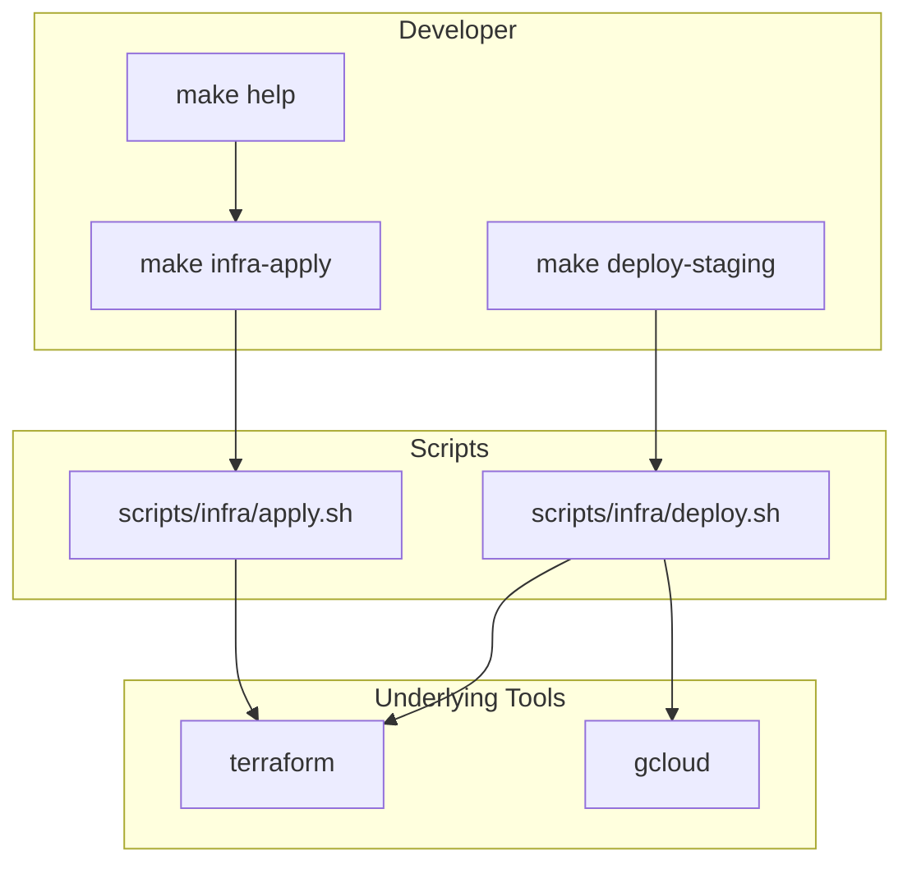

# Infra Deploy and Scripts: Industry Best Practices

## Your Situation

You use Make commands because Terraform and gcloud invocations are complex and hard to remember. Your Makefile already abstracts:

- `make infra-bootstrap` — targeted apply for Cloud Build, storage, IAM
- `make image-push` — gcloud builds submit with correct image URL
- `make infra-apply` — full apply with two-phase Firebase custom domain logic
- `make infra-gha-key` — create SA key and print instructions
- `make infra-a2a-url` — write A2A URL to file for the extension

Docs ([docs/infra/dev-loop-tasks.md](docs/infra/dev-loop-tasks.md), [docs/infra/site-deploy.md](docs/infra/site-deploy.md), [infra/README.md](infra/README.md)) consistently reference `make infra-*` as the primary interface.

---

## Industry Practice: Make as Infra Wrapper

**Using Make to wrap Terraform/gcloud is common and recommended.** Teams do this because:

1. **Terraform commands are long** — `terraform apply -var-file=X -var-file=Y -target=...` with many flags
2. **Environment-specific logic** — dev vs staging vs prod, different var files and targets
3. **Multi-step workflows** — bootstrap → image push → apply → post-apply (e.g. sync Sentry DSNs)
4. **Onboarding** — new devs run `make help` and `make infra-apply` instead of memorizing 10 commands

**Examples in the wild:**

- [terraform-makefile](https://github.com/serpro69/terraform-makefile) — Makefile as git submodule for Terraform + GCP
- CloudPosse, Gruntwork — Make or custom wrappers for Terraform orchestration
- Many OSS repos — `make deploy`, `make infra-apply`, `make build` as the public API

**Conclusion:** Your approach is aligned with industry practice. Make is a valid choice for "last-mile automation" (CloudPosse term) across Terraform, gcloud, and scripts.

---

## Alternatives to Make (When to Consider)


| Tool                | Best for                                                        | Trade-off                                        |
| ------------------- | --------------------------------------------------------------- | ------------------------------------------------ |
| **Make** (current)  | Universal, no extra deps, CI-friendly                           | Tab syntax, no params, cryptic `$@`              |
| **Just**            | Readable syntax, params (`just deploy staging`), cross-platform | No file-dependency tracking; pure command runner |
| **Task (Taskfile)** | YAML, checksum-based deps, readable                             | Extra binary; less universal than Make           |
| **Terragrunt**      | Multi-env Terraform, DRY backends                               | HCL config; adds another layer                   |
| **Atmos**           | Multi-stack, workflows, component orchestration                 | Heavier; for large multi-cloud setups            |


**Recommendation:** Stay with Make unless you hit specific pain (e.g. need `make deploy staging` with a param, or Windows support). Your Makefile is already effective; switching tools has migration cost.

---

## Infra Deployment Best Practices You're Aligned With

1. **Abstraction over raw commands** — `make infra-apply` instead of 20-line terraform invocations
2. **Documentation points to Make** — [dev-loop-tasks.md](docs/infra/dev-loop-tasks.md) says "make infra-bootstrap", "make infra-apply"
3. **Runbooks with checklists** — [site-deploy.md](docs/infra/site-deploy.md) has pre-deploy checklist and links to Make
4. **Var files for env config** — `dev.tfvars`, `secrets.tfvars`; tag passed via CLI in CI
5. **Post-apply automation** — `make sync-sentry-dsns` after apply

---

## Gaps and Improvements

### 1. Staging/Production Deploy Make Targets (High Value)

**Gap:** [releasing.md](docs/infra/releasing.md) documents manual `terraform apply -var-file=staging.tfvars -var-file=secrets.tfvars -var="a2a_image=..."` but there is no `make deploy-staging` or `make deploy-prod`.

**Recommendation:** Add Make targets so you never type the full Terraform command:

```makefile
# Example (conceptual)
deploy-staging: ## Deploy to staging (TAG=v0.2.0)
	cd infra && terraform apply -var-file=staging.tfvars -var-file=secrets.tfvars \
		-var="a2a_image=$(IMAGE_URL)" -var="a2a_min_instance_count=1" -auto-approve

deploy-prod: ## Promote to production (TAG=v0.2.0, same as staging)
	cd infra && terraform apply -var-file=prod.tfvars -var-file=secrets.tfvars \
		-var="a2a_image=$(IMAGE_URL)" -var="a2a_min_instance_count=0" -auto-approve
```

With `IMAGE_URL` derived from `TAG`, `GCP_PROJECT_ID`, `REGION`. Then releasing.md becomes: "Run `make deploy-staging TAG=v0.2.0` then `make deploy-prod TAG=v0.2.0`."

### 2. Single "Deploy" Entry Point with Env Param

**Alternative pattern:** One target with an env parameter. Just supports this natively (`just deploy staging`); Make can simulate with:

```makefile
deploy: ## Deploy to ENV (ENV=staging|prod, TAG required)
	@test -n "$(TAG)" || (echo "Usage: make deploy ENV=staging TAG=v0.2.0"; exit 1)
	./scripts/infra/deploy.sh $(ENV) $(TAG)
```

Move the Terraform logic into `scripts/infra/deploy.sh` so the Makefile stays thin. This matches the "write small targets; move complex logic into shell scripts" best practice.

### 3. Runbook → Make Mapping

**Gap:** Some docs still show raw `terraform` and `gcloud` commands (e.g. [releasing.md](docs/infra/releasing.md) Options A and B). New contributors may not discover the Make equivalents.

**Recommendation:** Add a "Quick reference" table to [docs/infra/README.md](docs/infra/README.md) or [dev-loop-tasks.md](docs/infra/dev-loop-tasks.md):


| Task                          | Make command            |
| ----------------------------- | ----------------------- |
| Bootstrap (APIs, bucket, IAM) | `make infra-bootstrap`  |
| Build and push image          | `make image-push`       |
| Full Terraform apply          | `make infra-apply`      |
| Create GitHub Actions key     | `make infra-gha-key`    |
| Write A2A URL for extension   | `make infra-a2a-url`    |
| Sync Sentry DSNs after apply  | `make sync-sentry-dsns` |


And in releasing.md: "Prefer `make deploy-staging TAG=v0.2.0` over manual terraform apply."

### 4. State Bucket Creation

**Gap:** [infra/README.md](infra/README.md) and [dev-loop-tasks.md](docs/infra/dev-loop-tasks.md) show manual `gsutil mb` and `gsutil versioning set`. No Make target.

**Recommendation:** Add `make infra-state-bucket` that runs the gsutil commands (with `PROJECT` from `dev.tfvars` or env). One-time use but removes a memorization burden.

### 5. Terraform Init with Backend

**Gap:** Backend init is manual: `terraform init -reconfigure -backend-config="bucket=..."`. CI does this in workflows; locally it's copy-paste from README.

**Recommendation:** `make infra-init` that reads `GCP_PROJECT_ID` (from env or tfvars) and runs init with the standard bucket name. Document: "First time: `make infra-state-bucket` then `make infra-init`."

---

## Summary: Infra-Specific Actions


| Priority | Action                                                                            | Effort |
| -------- | --------------------------------------------------------------------------------- | ------ |
| 1        | Add `make deploy-staging` and `make deploy-prod` (or `deploy.sh` + `make deploy`) | Medium |
| 2        | Add runbook → Make mapping table to docs                                          | Low    |
| 3        | Add `make infra-state-bucket` and `make infra-init`                               | Low    |
| 4        | Update releasing.md to prefer Make over raw terraform                             | Low    |


---

## Combined with Scripts/Make Best Practices (from prior plan)

From the earlier analysis, you should also:

- Add **ShellCheck** to pre-commit and CI
- Fix `set -euo pipefail` in `run_auth_callback_local.sh` and `try_extension.sh`
- Add `make shellcheck` target
- Optionally extract `infra-apply` inline logic into `scripts/infra/apply.sh`

---

## Architecture: Recommended Flow




Developer runs high-level Make targets; complex logic lives in scripts; scripts invoke terraform/gcloud.