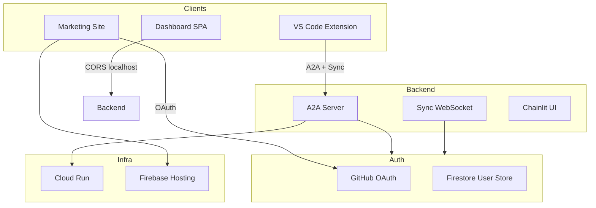

# POC to Pre-seed Launch Readiness Investigation

## Executive Summary

The codebase has strong foundations: strict typing, solid CI (format/lint/typecheck/test), security scanning (OSV, Trivy), and clear architecture. Several areas still show POC fingerprints: hardcoded URLs, bare exception handlers, deprecated code in use, missing production config, and gaps in testing and documentation. This plan prioritizes fixes by impact and effort.

---

## 1. Critical: Configuration and URLs

### 1.1 Hardcoded placeholder URLs

| Location                                                                         | Issue                                               | Fix                                                                                       |
| -------------------------------------------------------------------------------- | --------------------------------------------------- | ----------------------------------------------------------------------------------------- |
| [auth_middleware.py:19](apps/backend/src/refactor_agent/a2a/auth_middleware.py)  | `ACCESS_REQUEST_URL = "https://refactor-agent.dev"` | Use `os.environ.get("ACCESS_REQUEST_URL", "https://refactorum.com")` and add to Terraform |
| [a2a/server.py:40](apps/backend/src/refactor_agent/a2a/server.py)                | Agent card `url="http://localhost:9999/"`           | Make configurable via `A2A_PUBLIC_URL` env; Terraform passes Cloud Run URL                |
| [RefactorViewProvider.ts:211](apps/vscode-extension/src/RefactorViewProvider.ts) | Default `https://refactor-agent.dev`                | Align with production: `https://refactorum.com` or configurable                           |
| [package.json:87](apps/vscode-extension/package.json)                            | Same default                                        | Update to `https://refactorum.com`                                                        |

**Terraform gap:** Cloud Run env does not set `ACCESS_REQUEST_URL` or `A2A_PUBLIC_URL`. Add to [infra/a2a/cloudrun.tf](infra/a2a/cloudrun.tf) (or site module) and pass `site_url` / `a2a_url` from outputs.

### 1.2 Dashboard CORS

[main.py:49-52](apps/backend/src/refactor_agent/dashboard/main.py) hardcodes `localhost:5173` only. Add `REFACTOR_AGENT_DASHBOARD_ORIGINS` env (comma-separated) for production dashboard URL(s).

---

## 2. Critical: Exception Handling

**20+ bare `except Exception:` clauses** across auth, sync, orchestrator, and engine code. They hide real errors and make debugging hard.

| File                                                             | Count | Risk                                      |
| ---------------------------------------------------------------- | ----- | ----------------------------------------- |
| `functions/auth_callback/main.py`                                | 6     | Auth failures silently return None/[]     |
| `functions/auth_register_device/main.py`                         | 5     | Device registration failures masked       |
| `functions/email_notify/main.py`                                 | 1     | Email errors swallowed                    |
| `auth_middleware.py` (via user_store)                            | —     | Rate limit check fails → allows request   |
| `sync/server.py`, `orchestrator/agent.py`, `schedule/planner.py` | 4     | Refactor failures return generic messages |
| `libcst_engine.py`, `codebase_structure.py`                      | 3     | Parse failures lose context               |

**Recommendation:** Replace with specific exception types where possible; log with `logger.exception` before re-raising or returning; avoid silent `pass` or `return None` for user-facing flows. Prioritize auth callbacks and sync.

---

## 3. High: Deprecated Code and Typos

### 3.1 `reponse` module (typo + deprecated)

- [reponse/index.ts](apps/vscode-extension/src/reponse/index.ts) is marked `// TODO: DEPRECATED` but still imported by [RefactorViewProvider.ts:19](apps/vscode-extension/src/RefactorViewProvider.ts).
- Typo: "reponse" → "response".

**Options:** (a) Inline `parseRenameIntentFromPrompt` into RefactorViewProvider and delete the module; (b) Rename to `response` and remove deprecation if still needed; (c) Remove usage if feature is obsolete.

### 3.2 Placeholder Terraform

[infra/site/main.tf](infra/site/main.tf) contains only a comment. Either implement or remove; docs reference "site-terraform todo" — clarify in [docs/infra/site-deploy.md](docs/infra/site-deploy.md) that site infra lives elsewhere (e.g. `firebase_hosting.tf`, `cloudfunctions_*.tf`).

---

## 4. High: Security and Production Hardening

### 4.1 Cloud Run IAM

[cloudrun.tf:76-81](infra/a2a/cloudrun.tf): `member = "allUsers"` for invoker. Comment says "dev only; restrict with IAM for production." For pre-seed: consider IAM-based auth or keep `allUsers` but ensure A2A auth middleware (GitHub token) is the real gate; document the tradeoff.

### 4.2 VS Code webview nonce

[webview/index.ts:375](apps/vscode-extension/src/webview/index.ts): `// TODO: Is this safe?` — CSP nonce per request is standard. The implementation is fine; extract to a small `getNonce()` in a shared util, add a brief comment, and remove the TODO.

### 4.3 ACCESS_REQUEST_URL in production

Pending users see "Apply at {access_url}". If `ACCESS_REQUEST_URL` is wrong (refactor-agent.dev), they get a broken link. Must fix before launch.

---

## 5. Medium: Site and Marketing Polish

### 5.1 SEO and meta tags

[apps/site/index.html](apps/site/index.html) has no `<meta name="description">`, `og:title`, `og:description`, or `og:image`. Add for social sharing and search.

### 5.2 Imprint fallback

[Imprint.tsx:75-77](apps/site/src/routes/Imprint.tsx): When env vars are empty, shows "Contact information will be available soon." For launch, ensure `VITE_IMPRINT`_* are set (Terraform syncs from `secrets.tfvars`). Add a pre-launch checklist item.

### 5.3 Error page

[Error.tsx](apps/site/src/routes/Error.tsx) is generic ("Something went wrong"). Consider adding a support/contact link for failed access requests.

---

## 6. Medium: Testing and Quality Gates

### 6.1 No TypeScript tests

- No `*.test.ts` / `*.spec.ts` in dashboard, site, vscode-extension, or packages.
- Add Vitest (or Jest) for critical paths: design-system components, dashboard API client, extension auth flow.

### 6.2 No Python coverage reporting

- No pytest-cov; no coverage thresholds in CI.
- Add `pytest-cov` with a modest threshold (e.g. 60%) for `apps/backend`; fail CI if below.

### 6.3 Security test placeholders

[tests/security/chainlit/](apps/backend/tests/security/chainlit/) — placeholder. Either implement basic checks or remove to avoid false confidence.

---

## 7. Medium: Documentation and DX

### 7.1 Root CONTRIBUTING.md

Contributing docs live in `docs/contributing/`. Add a root `CONTRIBUTING.md` that links to `docs/contributing/README.md` (GitHub expects this).

### 7.2 Dependabot

No `.github/dependabot.yml`. Add for Python (pyproject.toml, uv.lock) and pnpm (package.json, pnpm-lock.yaml) to get automated dependency update PRs.

---

## 8. Low: Engine Stubs and Minor Cleanup

- [libcst_engine.py:256](apps/backend/src/refactor_agent/engine/python/libcst_engine.py): `extract_function` stub.
- [ts_morph_engine.py:103](apps/backend/src/refactor_agent/engine/typescript/ts_morph_engine.py): "Not implemented for TypeScript."
- [ui/app.py:72](apps/backend/src/refactor_agent/ui/app.py): Temporary comment about NestJS playground.

Document these as known limitations or create issues; low priority for launch if not user-facing.

---

## 9. Architecture Overview (Current State)

---

## 10. Recommended Priority Order

| Phase                 | Items                                                                                                         | Effort    |
| --------------------- | ------------------------------------------------------------------------------------------------------------- | --------- |
| **Pre-launch (must)** | 1.1 ACCESS_REQUEST_URL + A2A_PUBLIC_URL, 1.2 CORS, 2 (auth/sync exception handling), 3.1 reponse cleanup, 4.3 | ~2–3 days |
| **Launch week**       | 5.1 SEO meta, 5.2 Imprint checklist, 6.1 TS tests (minimal), 7.1 CONTRIBUTING.md, 7.2 Dependabot              | ~2 days   |
| **Post-launch**       | 2 (remaining exception handlers), 6.2 coverage, 6.3 security tests, 4.1 IAM decision, 8 engine stubs          | Ongoing   |

---

## Files to Modify (Summary)

- **Config/URLs:** `auth_middleware.py`, `a2a/server.py`, `infra/a2a/cloudrun.tf`, `dashboard/main.py`, VS Code extension config
- **Exceptions:** `functions/auth_callback/main.py`, `functions/auth_register_device/main.py`, `sync/server.py`, `orchestrator/agent.py`, others
- **Cleanup:** `reponse/` → inline or rename, `infra/site/main.tf`
- **Site:** `index.html` (meta tags), `Imprint.tsx` (checklist)
- **Docs:** `CONTRIBUTING.md`, `.github/dependabot.yml`
- **Tests:** Add Vitest, pytest-cov

