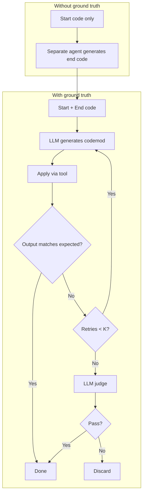

# Extensible codemods

Design note: extending the refactor system from a limited set of basic transforms to arbitrary codemods.

## Context

Today the LLM picks from a **limited set of basic transforms** (rename, move symbol, move file, remove node, organize imports). Planning lets the LLM emit a schedule of these transforms, but the manifold is fixed. The goal: extend to **any codemod** — arbitrary code transformations beyond the predefined ops.

See [generated-codemod-refactoring.md](../generated-codemod-refactoring.md) for implementation context (ts-morph, LibCST, sandboxing).

## Two acquisition paths

1. **On-the-fly generation** — Generate the codemod at request time, apply it, validate. No pre-existing codemod library required.
2. **RAG on codemod codebase** — Index pre-existing codemods (e.g. react-codemod, LibCST examples, community registry). Retrieve relevant codemods for the task via semantic search. See [Embedding codemods for RAG](#embedding-codemods-for-rag) below.

## Iterative generation loop

For both paths, when *generating* a codemod (rather than retrieving one), use an iterative loop:

### With ground truth

Given `(start_code, end_code)`:

1. LLM generates codemod.
2. Apply via tool.
3. If output matches expected → done.
4. Else: retry up to K times.
5. If still not matching after K retries → LLM-as-judge decides: pass (accept) or discard.

### Without ground truth

Given `start_code` only:

1. Separate agent generates expected `end_code` (ground truth).
2. Continue as per "With ground truth" above.

## Embedding codemods for RAG

To support RAG over a codemod codebase, codemods need to be embeddable for semantic search. Options:

- **Option A — Generated description**: LLM generates a natural-language description from (input snippet, output snippet, transform logic). Embed the description; query with user intent or code snippet.
- **Option B — Structured text**: Concatenate or template: `"Input: {input}\nOutput: {output}\nTransform: {transform_summary}"`. Embed the combined text.
- **Option C — Code embeddings**: Use code-specific embedding models (e.g. [CodeXEmbed](https://arxiv.org/abs/2411.12644), [CoRet](https://arxiv.org/abs/2505.24715)) to embed input/output pairs or the transform code itself. Query with the user's "before" code or intent.

Trade-off: embedding the *description* is simpler and language-agnostic; embedding *code* may better match structural similarity.

## Prior art: Codemod.com

[Codemod.com](https://codemod.com/) is a platform for large-scale code transformations and migrations.

### Platform features

- **Studio** — Web-based IDE for building and testing codemods; visual AST explorer; AI-assisted creation.
- **Codemod AI** — Generates codemods from before/after code pairs plus optional human-language description. Iterative refinement loop: apply → detect errors (compiler, runtime, diff) → feed back to LLM → revise. Real-time updates via WebSocket; supports multiple models (e.g. GPT-4o).
- **Engines** — ast-grep, JSSG (ast-grep + JS runtime), jscodeshift, ts-morph. JSSG is now primary.
- **Registry** — Public/private codemods for React, Next.js, Nuxt, etc.
- **Workflows** — Multi-step pipelines: deterministic AST transforms + AI steps + shell commands. Hybrid pattern: AST for bulk, AI for edge cases.
- **Campaigns** — Multi-repo migrations, centralized state, auto PRs.
- **CLI** — `npx codemod run`; dry-run, diff, rollback.
- **MCP** — Codemod MCP for local AI-assisted codemod creation.

### Their iterative AI approach

- Input: before/after pairs + optional description.
- Draft codemod → run tools (tsc, codemod runner, diff) → feedback + knowledge base (engine types, common issues) → LLM revises. Repeat until correct or max iterations.
- **Accuracy**: Vanilla GPT-4o ~26% (ts-morph) / ~45% (jscodeshift); after 3–4 iterations ~54% / ~75%.
- They note: "refinement iterations for ts-morph are currently basic and **lack RAG or any advanced optimizations**" — RAG is an acknowledged gap.
